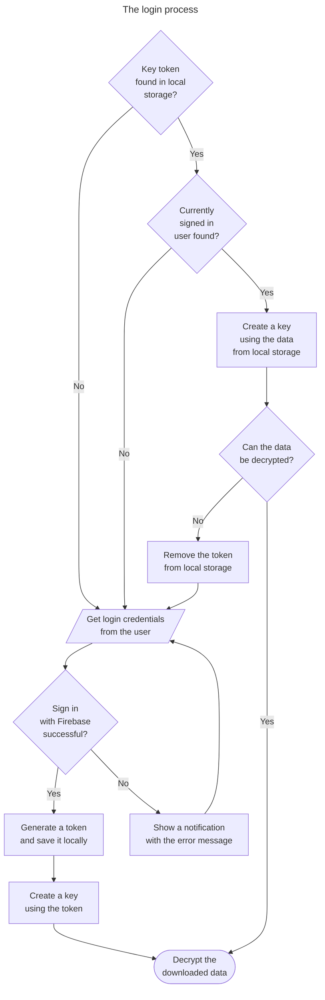

# Passer

Free, open-source and self-hosted password manager.

Passer is a [React](https://react.dev/) website with the design inspired by the [Material Design](https://m3.material.io/), and a backend fully managed by [Firebase](https://firebase.google.com/), that can be comfortably hosted with a free account.

## Security

Every password with its site data is serialized and client-side encrypted before being stored in the database, using the [SubtleCrypto](https://developer.mozilla.org/en-US/docs/Web/API/SubtleCrypto) interface with the AES-GCM algorithm.

The [CryptoKey](https://developer.mozilla.org/en-US/docs/Web/API/CryptoKey) used for encryption and decryption is generated using a salted hash from the user's password and e-mail, that never leaves your device.

Authentication with its state persistance is entirely done through Firebase, but in order to decrypt the downloaded data, the generated hash is later stored locally to create the key.
As the hash is not used for the Firebase account creation, it is not possible to get into someone else's account, if the locally stored hash was compromised.

## License

This project is licensed under the GNU General Public License.
\
Please see the [license file](LICENSE) for more information.
